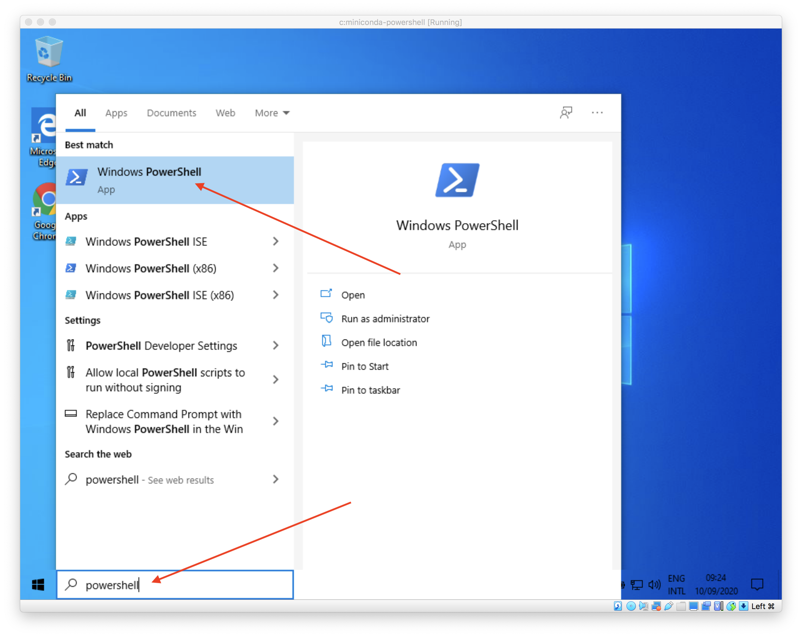

---
jupytext:
  cell_metadata_filter: all,-hidden,-heading_collapsed
  formats: md:myst
  notebook_metadata_filter: all,-language_info,-toc,-jupytext.text_representation.jupytext_version,-jupytext.text_representation.format_version
  text_representation:
    extension: .md
    format_name: myst
kernelspec:
  display_name: Calysto Bash
  language: bash
  name: calysto_bash
notebookname: "installation miniconda revisit\xE9e"
---

<div class="licence">
<span>Licence CC BY-NC-ND</span>
<div style="display:grid">
    <span>Thierry Parmentelat</span>
    <span>Valérie Roy</span>
</div>
<div style="display:grid">
    <span></span>
    <span></span>
</div>
</div>

+++

# installation miniconda revisitée

version revisitée de la procédure d'installation de miniconda

peut être utilisée par tout le monde, mais s'adresse surtout **à ceux qui ont un accent dans leur nom**, et qui recoivent le message `Permission denied` lorsqu'ils essaient de lancer la commande `python` ou `python -i` dans leur terminal


## désinstaller 

il va vous falloir désinstaller la version précédente, si elle est toujours présente sur votre ordi

je vous laisse chercher sur Internet comment faire ça, commencez par chercher sur google *uninstall miniconda*

## réinstaller

l'installeur miniconda se prend les pieds dans le tapis si on lui demande d'installer dans un chemin qui contient des accents

du coup notre approche vas être de 

* créer un dossier avec un nom court et simple; on va choisir l'emplacement `c:/miniconda` 
* il suffira ensuite de relancer l'installeur miniconda, en lui précisant cet emplacement au lieu de prendre le chemin qu'il nous propose par défaut

+++

## Python - installation revisitée

+++ {"tags": []}

### installation de base

* il y a de très nombreuses distributions disponibles
* notre recommandation : miniconda  
  * relativement léger
  * permet d'installer en mode "user" i.e. sans droits administrateur
* (ça va sans le dire mais ne prenez **surtout pas Python 2.7** !) 


Nous allons

* faire une démonstration de l'installation miniconda sur Windows à partir de <https://docs.conda.io/en/latest/miniconda.html> (les linux et les macos le font pour leur OS + architectures)
* puis écrire un ou deux programmes Python très simples
* et les exécuter dans un terminal

+++

### préparation : création d'un dossier `c:\miniconda`

+++

nous allons créer un dossier dont le nom est court et simple, et **qui ne contient pas d'accent**

pour cela nous allons lancer la console Windows qui s'appelle `PowerShell`, et créer le dossier `c:/miniconda`

ça se présente comme ceci

+++

pour lancer la console `PowerShell`



+++

pour créer le dossier dans lequel on installera ensuite miniconda

il y a une seule ligne à taper

```console
md c:/miniconda
```


+++

une fois la commande tapée vous pouvez sortir de PowerShell (utiliser la croix en haut à droite par exemple)

+++

### installation de miniconda

+++

à ce stade on peut lancer l'installation de miniconda


+++

vous lancez le `.exe`, vous prenez toutes les options par défaut lorsqu'on vous pose une question, sauf pour les deux écrans qui suivent

+++

<div style="background-color:#cccccc; border-radius: 6px; margin:12px; padding: 12px;">

<span style="background-color:red; padding:4px; border-radius: 4px;">
c'est ici que la procédure diffère de la version faite en amphi 
</span>    
</div>

sur cet écran vous remplacez le chemin qu'on vous propose par défaut, et vous choisissez à la place le dossier qu'on a créé dans l'étape précédente


+++

il est important de bien cocher cette case


+++

### première utilisation / vérification

+++

à ce stade vous pouvez reprendre [le cours du notebook officiel](0-02-outils)
